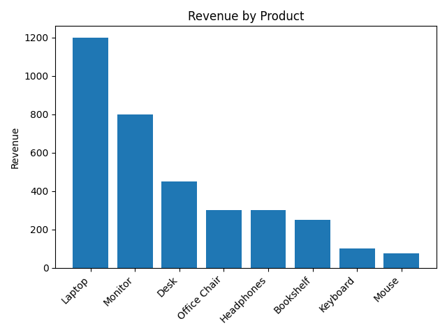

# Sales Dataset Revenue Analysis (SQL + Python)

## Project Overview
This project demonstrates a simple end-to-end data analysis workflow using SQL and Python.
The goal is to analyze sales data stored in a SQLite database and extract meaningful insights.

## Dataset
The dataset is a synthetic sales dataset containing:
- order information
- customer country
- product details
- quantity and unit price

The raw data is stored in CSV format and loaded into a SQLite database.

## Tools & Technologies
- SQL (SQLite)
- Python
- pandas
- matplotlib
- Git & GitHub

## Project Structure
```text
data/
  raw/                # Raw CSV data
  sales.db            # SQLite database
sql/
  schema.sql          # Database schema
  queries.sql         # Analysis queries
src/
  analysis.py         # Python analysis script
output/
  revenue_by_product.png
  ```

## Analysis Performed
The analysis includes:
- Total revenue calculation
- Revenue by product
- Revenue by customer country
- Identification of the top customer

SQL is used for aggregation and filtering, while Python is used for data handling and visualization.

## Output
The project produces:
- Aggregated tables using SQL
- A revenue-by-product bar chart saved as an image

## Example output:

